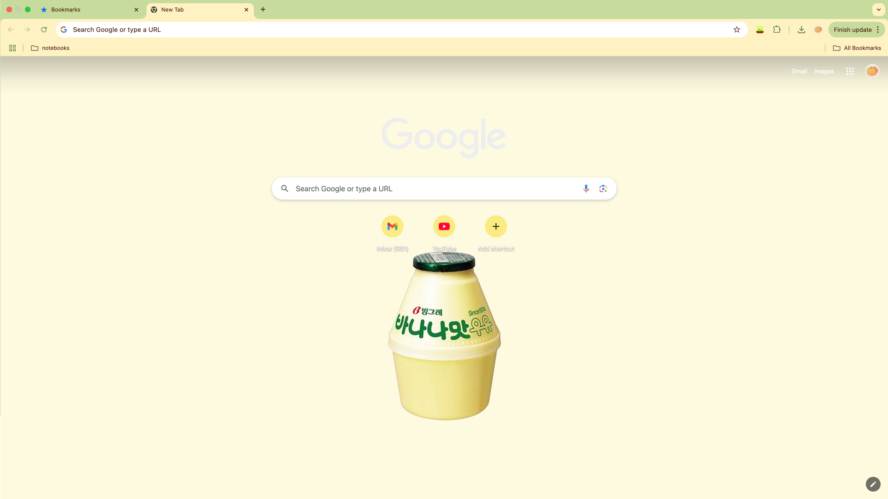
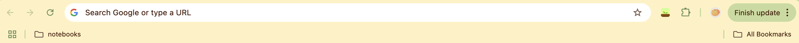
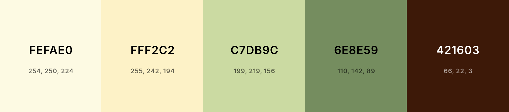

# GSOC25-ChromeTheme: Banana Milk 🍌🥛

A warm, modernistic Google Chrome theme for the starter task of GSOC25 Chromium: Add 3rd Party Theme Support for Tab Groups. This Chrome theme is inspired by the popular Korean banana milk brand Binggrae.

## Theme Preview

### Tool Bar

### Color Palette

## HOW TO:

### Running Theme With Source Code (Unpacked):

1. To retrieve the unpacked source code, `git clone https://github.com/YUUU23/GSOC25-ChromeTheme` or download the `src` folder in this directory
2. In a Chrome browser, visit `chrome://extensions/`
3. Toggle on 'Developer Mode'
4. Click on the 'Load unpacked' button and upload the `src` folder, this will install the theme to your Chrome browser

### Running Theme with `.crx` File (Packed):

1. Download the `src.crx` file from `https://github.com/YUUU23/GSOC25-ChromeTheme`
2. In a Chrome browser, visit `chrome://extensions/`
3. Toggle on 'Developer Mode'
4. Drag and drop the `src.crx` file in, this will install the theme to your Chrome browser

## Editing This Theme:

1. `git clone https://github.com/YUUU23/GSOC25-ChromeTheme` and go to `src` folder for source code
2. In `manifest.json`, you can make changes to colors and images/image positions by editing the values of the associated attributes in the `theme` JSON object:
   - `colors`: Changes main colors of browser UI components such as frame, toolbar, or component text colors.
   - `tints`: Changes hue, saturation, and lightness of UI components, such as buttons.
   - `images`: Changes the new tab page background image.
   - `properties`: Changes alignment of the main image in new tab page.

## Credits:

- [Banana Milk Image](src/images/banana-clear.png):
  - Image Credit: [Pinterest](https://www.pinterest.com/pin/308989224451704261/).
  - Background removed with: [Online background remover](https://www.adobe.com/express/feature/image/remove-background)
- Theme: Created by [YUUU23](https://github.com/YUUU23) :3
